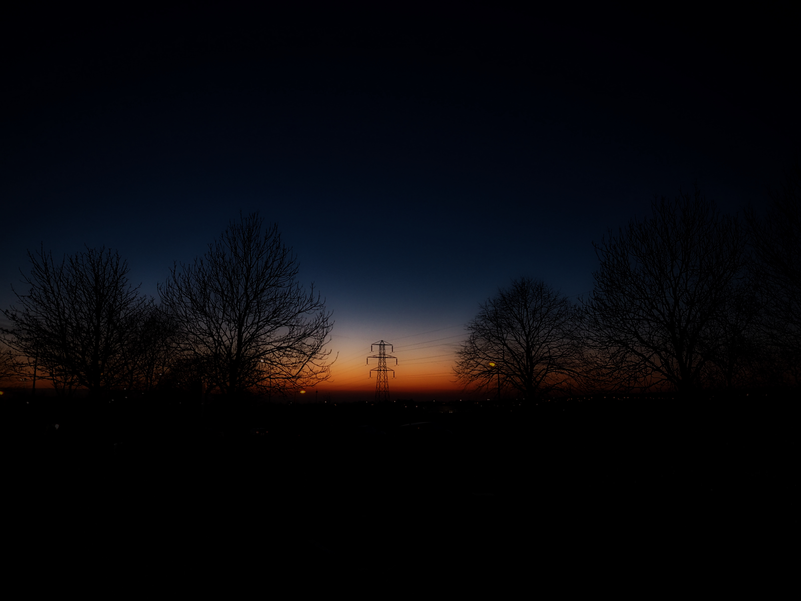

This project is a challenge to take 100 photos over the course of 100 days. In each day you need to capture a moment, a scene, an emotion, something that represents that day in this journey of a hundred photos.
I hope you enjoy it as much as I will!

<figure>
  
  <figcaption>001 - Flight over London</figcaption>
</figure>

<figure>
  
  <figcaption>002 - Lonely giant</figcaption>
</figure>

<figure>
  
  <figcaption>003 - Hiding from the cold</figcaption>
</figure>
